<p align="center">
  
</p>

<h1 align="center">M·Hike</h1>

<p align="center"><b>Plan, record and share your hikes.</b></p>

<p align="center">
  A hike-management app built twice with one design language —<br/>
  once as a full native Android app in Java, once as a cross-platform prototype in .NET MAUI.
</p>

<p align="center">
  
  
  
  
  
</p>

---

## Why M·Hike?

Halfway up a mountain there is no signal — so everything in M·Hike lives in a
local SQLite database and works fully offline. Plan a hike in advance, log
observations while you walk (wildlife, trail conditions, a quick photo),
then find any trip again in seconds with live search.

## Screenshots

| Living welcome | Rainy mode | Hike list | Entry form |
|:---:|:---:|:---:|:---:|
| 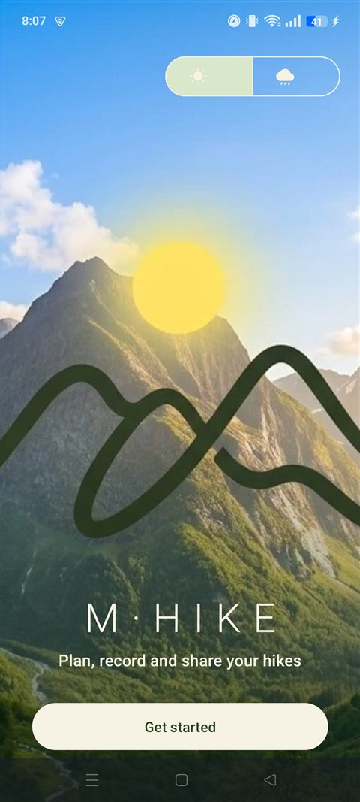 | 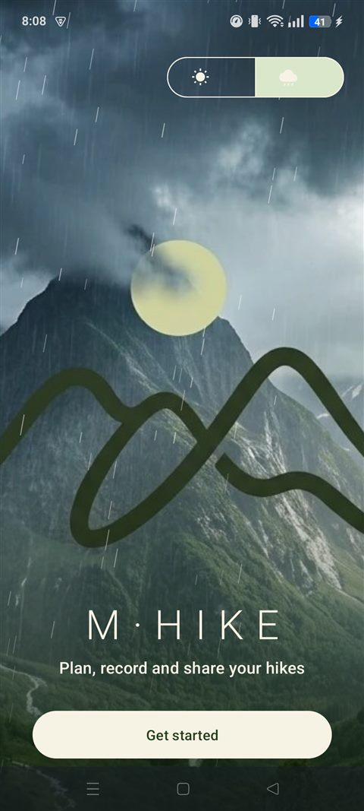 | 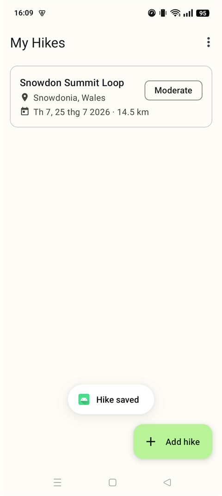 | 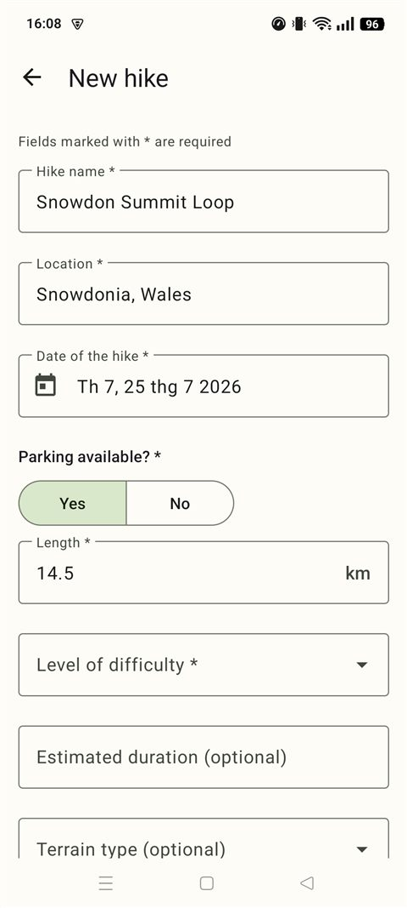 |
| Ken Burns scenery drift | Real-time rain animation | Material 3 cards | Pickers over typing |

| Confirmation | Detail & observations | Advanced search | Dark theme |
|:---:|:---:|:---:|:---:|
| 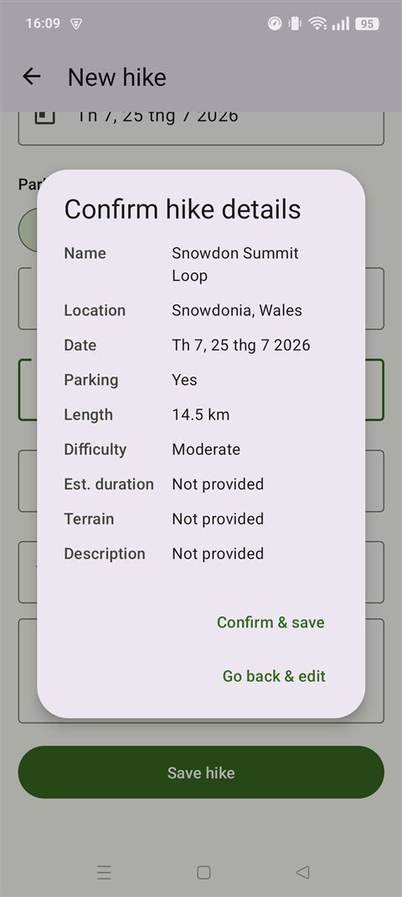 | 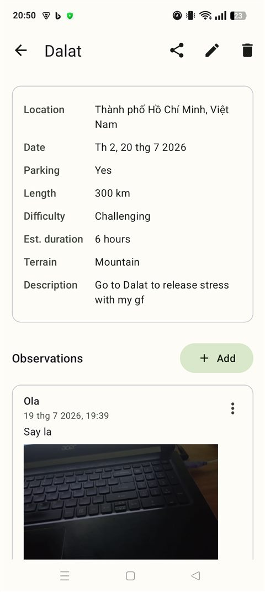 | 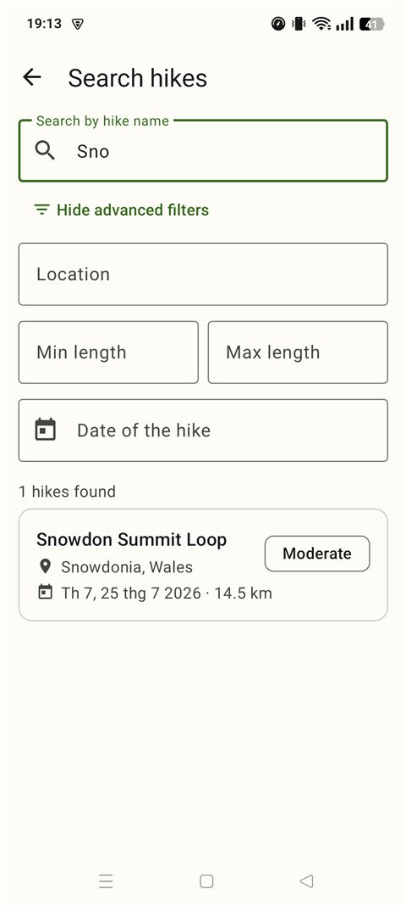 | 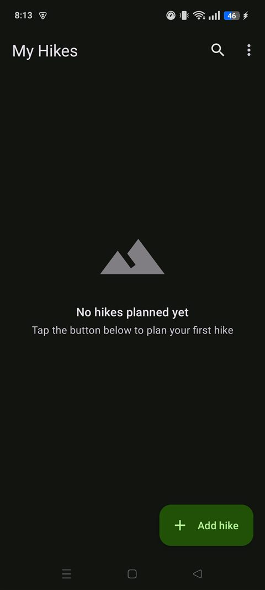 |
| Review before saving | Camera photos on the trail | Name, location, length, date | Switchable any time in-app |

<details>
<summary><b>MAUI prototype screenshots</b></summary>
<br/>

| Hike list | Confirmation |
|:---:|:---:|
| 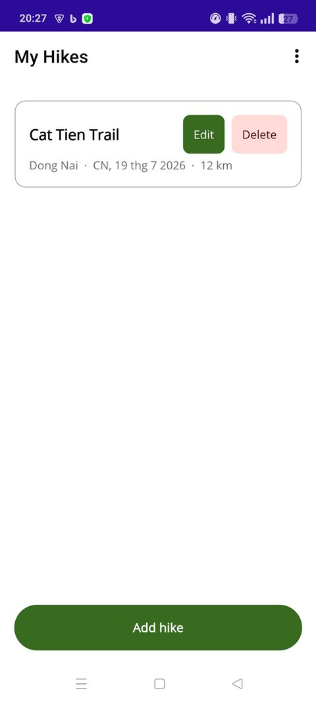 | 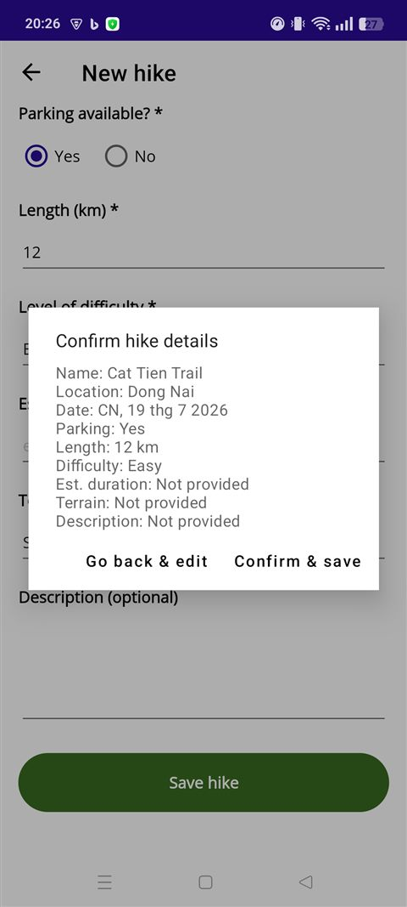 |

</details>

## Two implementations, one design

| | Native app | Cross-platform prototype |
|---|---|---|
| Location | [`app/`](app) | [`MHike.Maui/`](MHike.Maui) |
| Language | Java | C# |
| UI toolkit | Android Views + Material 3 | .NET MAUI (XAML) |
| Storage | SQLite via `SQLiteOpenHelper` | SQLite via `sqlite-net-pcl` |
| Scope | Full feature set | Hike entry + persistence |

Building the same product on both stacks was a deliberate exercise in
comparing native and cross-platform development: the native app gets deep
platform access (camera, adaptive icons, custom `Canvas` animation) while the
MAUI prototype shows how far a single C# codebase can go with a fraction of
the UI code.

## Features

**Planning & recording**
- Hike planner with name, location, date, parking, length, difficulty,
  estimated duration, terrain type and notes — every required field validated
  inline, and a summary dialog to confirm before anything is saved
- Multiple timestamped observations per hike, each with optional comments and
  a photo taken straight from the camera
- Edit or delete any hike or observation, or reset the whole database

**Finding things again**
- Live search-as-you-type on hike names
- Advanced filters: location, min/max length and exact date, combinable

**The little things**
- One-tap GPS location autofill, reverse-geocoded to a readable place name
- Share any hike as text through the system share sheet
- An animated first-launch welcome screen — drifting scenery in sunny mode,
  real-time rain in rainy mode — that doubles as the light/dark theme picker
- Full light & dark themes, switchable any time from the home screen

## Architecture

<p align="center">
  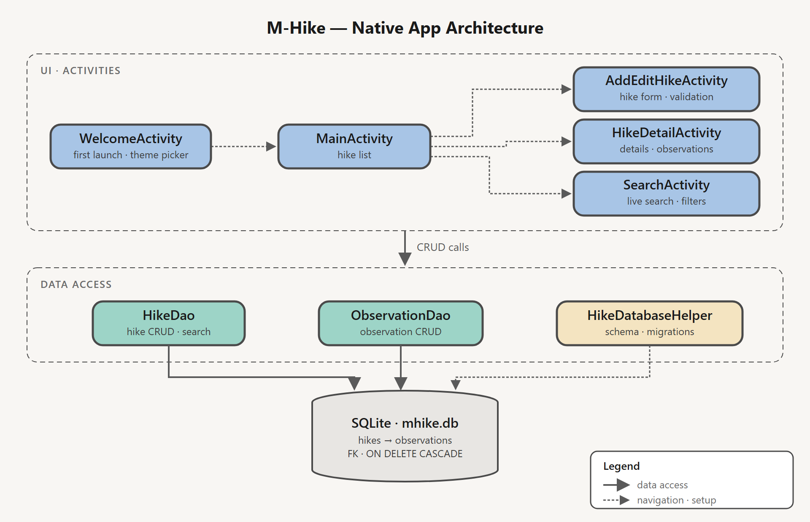
</p>

<details>
<summary><b>Use case diagram</b></summary>
<br/>
<p align="center">
  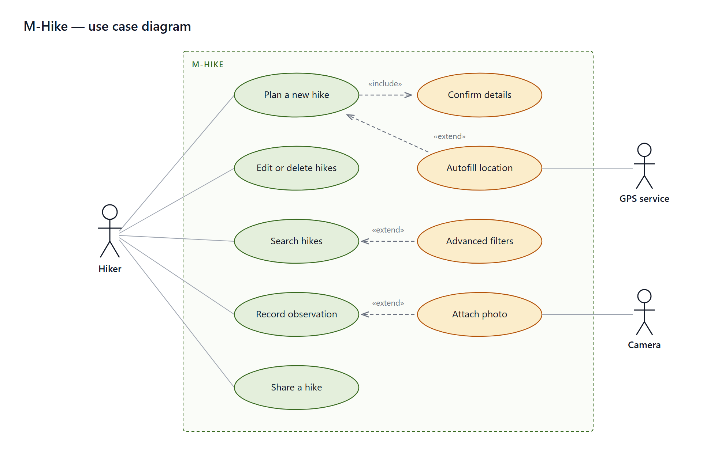
</p>
</details>

- Activities never touch SQL directly — all queries live in two DAO classes
  behind a shared `SQLiteOpenHelper`
- Hikes and observations are linked with a foreign key and `ON DELETE CASCADE`
- The rain effect is a custom `View` drawing ~110 independently-randomised
  drops per frame on a `Canvas`
- Edge-to-edge insets, adaptive launcher icon and Material 3 dynamic surfaces
  throughout

## Getting started

### Native Android app

Open the repository root in **Android Studio** and run the `app`
configuration (min SDK 24), or from the command line:

```bash
./gradlew :app:assembleDebug
adb install app/build/outputs/apk/debug/app-debug.apk
```

### MAUI prototype

Requires the **.NET 9 SDK** with the `maui-android` workload installed:

```bash
cd MHike.Maui
dotnet build -c Debug -p:EmbedAssembliesIntoApk=true
adb install bin/Debug/net9.0-android/com.luphihung.mhike.maui-Signed.apk
```

> The two apps use different application IDs (`com.luphihung.mhike` and
> `com.luphihung.mhike.maui`), so they install side by side on one device.

## Permissions

| Permission | Used for |
|---|---|
| `ACCESS_FINE_LOCATION` | Optional GPS autofill of the hike location |
| Camera <sub>(via system intent)</sub> | Observation photos — no camera permission required |

Everything stays on the device: no accounts, no analytics, no network calls
except reverse geocoding when you ask for your location.

## Project structure

```
app/                          Native Android app (Java)
 └─ src/main/java/com/luphihung/mhike/
     ├─ database/             SQLiteOpenHelper + DAOs
     ├─ model/                Hike, Observation
     ├─ adapter/              RecyclerView adapters
     ├─ widget/               Custom views (rain animation)
     └─ util/                 Formatting & insets helpers
MHike.Maui/                   Cross-platform prototype (C# / .NET MAUI)
 ├─ Models/  Data/            Entity + SQLite data layer
 └─ *.xaml                    Pages
docs/screenshots/             Images used in this README
```
